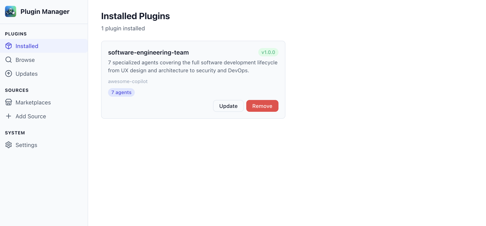
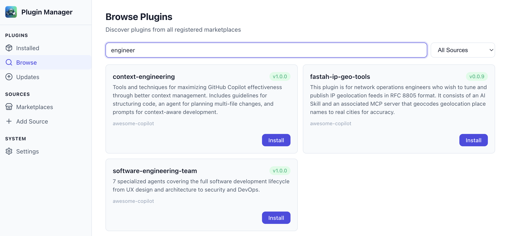
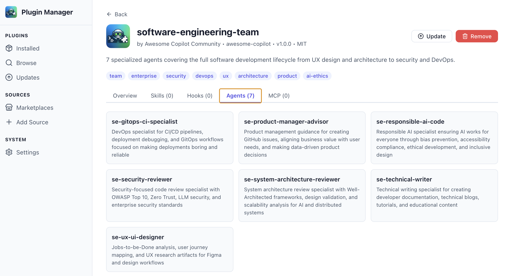

<p align="center">
  
</p>

<h1 align="center">Copilot CLI Plugin Manager</h1>

<p align="center">
  A visual plugin manager for <a href="https://docs.github.com/copilot/how-tos/copilot-cli">GitHub Copilot CLI</a> — browse, install, manage, and explore plugins from any marketplace, all from a web UI or native desktop app.
</p>

<p align="center">
  
  
  
  
</p>

## Why?

The Copilot CLI has a rich plugin ecosystem — skills, agents, hooks, MCP servers — but managing them is entirely command-line based. You need to memorize CLI syntax, know marketplace names, and manually inspect plugin contents.

This project gives you a **visual interface** for the full plugin lifecycle:

- **Browse** plugins across all your registered marketplaces with search and filtering
- **Install** plugins with one click — from any marketplace or GitHub repo
- **Inspect** what's inside — skills, agents, hooks, MCP servers with descriptions
- **Manage** your installed plugins — update, uninstall, enable/disable
- **Add marketplaces** — register new plugin sources from GitHub repos or git URLs

## Quick Start

### Prerequisites

- [Node.js](https://nodejs.org/) 20+
- [GitHub Copilot CLI](https://docs.github.com/copilot/how-tos/copilot-cli) installed and authenticated
- [GitHub CLI](https://cli.github.com/) (`gh`) authenticated (for browsing private marketplaces)

### Web App

```bash
git clone https://github.com/cohenamitc/copilot-cli-plugin-manager.git
cd copilot-cli-plugin-manager
npm install
npm run dev
# Open http://localhost:5173
```

### Desktop App (Electron)

```bash
npm run desktop
```

Launches a native window with system tray integration. The backend runs internally — no separate server needed.

## Screenshots

### Installed Plugins
Browse your installed plugins with version badges, component counts (skills, hooks, agents, MCP), and quick actions.



### Marketplace Browser
Search and filter across all registered marketplaces. Install plugins with one click.



### Plugin Detail
Drill into any plugin to see its skills, hooks, agents, and MCP servers in a tabbed view.



## Features

### Plugin Management
| Feature | Description |
|---------|-------------|
| **Browse** | Search plugins across all marketplaces by name, description, or keywords |
| **Install** | One-click install from any marketplace or direct GitHub repo |
| **Uninstall** | Remove plugins cleanly (files + config entries) |
| **Update** | Re-install plugins to get the latest version |
| **Details** | View skills, agents, hooks, and MCP servers bundled in each plugin |
| **Fetch Catalog** | Fetch full marketplace catalogs for uncached sources |

### Marketplace Management
| Feature | Description |
|---------|-------------|
| **List** | View all registered marketplaces (defaults + custom) |
| **Add** | Register new marketplaces from GitHub repos, git URLs, or local paths |
| **Remove** | Unregister custom marketplaces |
| **Refresh** | Update marketplace catalogs via `copilot plugin marketplace update` |

### UI Features
| Feature | Description |
|---------|-------------|
| **Sidebar Navigation** | Organized sections: Plugins, Sources, System |
| **3 Themes** | Light (default), Dark, Copilot (GitHub dark style) |
| **Search & Filter** | Real-time search with marketplace dropdown filter |
| **Toast Notifications** | Success/error feedback for all operations |
| **Responsive Grid** | Plugin cards adapt to window size |

### Desktop App (Electron)
| Feature | Description |
|---------|-------------|
| **Native Window** | Full desktop app experience |
| **System Tray** | Minimize to tray, quick access via tray icon |
| **Auto-restart** | Backend automatically restarts on crash |
| **Single Command** | `npm run desktop` builds and launches everything |

## Architecture

```
┌─────────────────────────────────────────────┐
│  React SPA (Vite)                           │
│  Sidebar │ Plugin List │ Detail │ Browse    │
│          │ Marketplaces│ Settings│ Updates   │
│                                             │
│  React Query for state │ CSS Modules        │
│  React Router for navigation                │
├─────────────────────────────────────────────┤
│  Express API Server (port 3200)             │
│                                             │
│  /api/plugins      GET, POST, DELETE        │
│  /api/marketplaces GET, POST, DELETE        │
│  /api/settings     GET, PUT                 │
├─────────────────────────────────────────────┤
│  Service Layer                              │
│                                             │
│  plugin-reader     Read config + scan dirs  │
│  marketplace-reader Read catalogs + API     │
│  plugin-ops        Install/uninstall/update │
│  marketplace-ops   Add/remove/refresh (CLI) │
├─────────────────────────────────────────────┤
│  Data Sources                               │
│                                             │
│  ~/.copilot/config.json      Installed list │
│  ~/.copilot/settings.json    Marketplaces   │
│  ~/.copilot/marketplace-cache/ Catalogs     │
│  ~/.copilot/installed-plugins/ Plugin files  │
│  GitHub API (via gh cli)     Remote catalogs│
└─────────────────────────────────────────────┘
```

### How Operations Work

**Read operations** (listing, browsing, details) read `~/.copilot/` config and cache files directly for speed.

**Marketplace operations** (add, remove, refresh) use `copilot plugin marketplace` CLI commands, which handle authentication, cloning, and caching internally.

**Plugin install/uninstall/update** use direct file operations — copying plugin directories and updating `config.json`/`settings.json` — because the CLI's `plugin install` command requires an interactive TTY.

**Catalog resolution** uses a multi-strategy fallback:
1. Local marketplace cache (`~/.copilot/marketplace-cache/`)
2. Installed plugin directories
3. GitHub API via authenticated `gh api` calls

## Project Structure

```
copilot-cli-plugin-manager/
├── src/
│   ├── server/                    # Express backend
│   │   ├── index.ts               # Server entry + SPA serving
│   │   ├── types.ts               # Shared TypeScript types
│   │   ├── routes/
│   │   │   ├── plugins.ts         # Plugin CRUD endpoints
│   │   │   ├── marketplaces.ts    # Marketplace endpoints
│   │   │   └── settings.ts        # Settings endpoints
│   │   └── services/
│   │       ├── plugin-reader.ts   # Read plugin metadata from disk
│   │       ├── plugin-ops.ts      # Install/uninstall/update operations
│   │       ├── marketplace-reader.ts # Read marketplace catalogs
│   │       ├── marketplace-ops.ts # Add/remove/refresh via CLI
│   │       └── cli-executor.ts    # CLI command wrapper utilities
│   ├── client/                    # React SPA
│   │   ├── App.tsx                # Routes + layout
│   │   ├── main.tsx               # React entry point
│   │   ├── types.ts               # Frontend types
│   │   ├── styles/
│   │   │   ├── themes.css         # Light/Dark/Copilot theme variables
│   │   │   └── global.css         # Reset + base styles
│   │   ├── hooks/                 # React Query hooks
│   │   │   ├── usePlugins.ts
│   │   │   ├── useMarketplaces.ts
│   │   │   └── useSettings.ts
│   │   └── components/
│   │       ├── Layout/            # Sidebar + main content shell
│   │       ├── Sidebar/           # Navigation sidebar
│   │       ├── PluginList/        # Installed plugins page
│   │       ├── PluginDetail/      # Detail view with tabs
│   │       ├── MarketplaceBrowser/# Browse + search plugins
│   │       ├── MarketplaceList/   # Manage marketplaces
│   │       ├── AddSource/         # Add marketplace form
│   │       ├── Updates/           # Plugin updates page
│   │       ├── Settings/          # Theme + about
│   │       └── common/            # Badge, Card, Toast, etc.
│   └── electron/                  # Desktop app
│       ├── main.cjs               # Electron main process
│       └── preload.cjs            # Security preload
├── package.json
├── tsconfig.json
├── vite.config.ts
├── vitest.config.ts
└── electron-builder.yml           # Desktop packaging config
```

## API Reference

### Plugin Endpoints

| Method | Endpoint | Description |
|--------|----------|-------------|
| `GET` | `/api/plugins` | List installed plugins with metadata and component counts |
| `GET` | `/api/plugins/:name/details` | Full plugin details including skills, hooks, agents, MCP servers |
| `POST` | `/api/plugins/install` | Install a plugin (`{ "source": "name@marketplace" }`) |
| `DELETE` | `/api/plugins/:name` | Uninstall a plugin |
| `POST` | `/api/plugins/:name/update` | Update a plugin to latest version |

### Marketplace Endpoints

| Method | Endpoint | Description |
|--------|----------|-------------|
| `GET` | `/api/marketplaces` | List registered marketplaces |
| `GET` | `/api/marketplaces/browse` | Browse plugins across all marketplaces (`?search=`, `?marketplace=`) |
| `GET` | `/api/marketplaces/:name/plugins` | Browse a specific marketplace |
| `POST` | `/api/marketplaces` | Add a marketplace (`{ "source": "owner/repo" }`) |
| `DELETE` | `/api/marketplaces/:name` | Remove a marketplace |
| `POST` | `/api/marketplaces/refresh` | Refresh marketplace catalogs |
| `POST` | `/api/marketplaces/:name/fetch` | Fetch full catalog for a specific marketplace |

### Settings Endpoints

| Method | Endpoint | Description |
|--------|----------|-------------|
| `GET` | `/api/settings` | Get current settings (theme) |
| `PUT` | `/api/settings` | Update settings (`{ "theme": "light\|dark\|copilot" }`) |

## Scripts

| Script | Description |
|--------|-------------|
| `npm run dev` | Start both Express server and Vite dev server with hot reload |
| `npm run build` | Build the React SPA and compile server TypeScript |
| `npm start` | Start the production server (after build) |
| `npm test` | Run the test suite (83 tests) |
| `npm run test:watch` | Run tests in watch mode |
| `npm run desktop` | Build and launch the Electron desktop app |
| `npm run desktop:build` | Package the desktop app for distribution |

## Testing

```bash
npm test
```

**83 tests** covering:

| Test Suite | Tests | Coverage |
|------------|-------|----------|
| `cli-executor.test.ts` | 16 | CLI command wrapping, streaming, all wrapper functions |
| `plugin-reader.test.ts` | 20 | Config parsing, plugin scanning, SKILL.md extraction, edge cases |
| `marketplace-reader.test.ts` | 17 | Marketplace resolution, catalog parsing, search filtering |
| `api.test.ts` | 30 | All REST endpoints, validation, error handling |

## Tech Stack

| Layer | Technology |
|-------|-----------|
| **Runtime** | Node.js 20+ |
| **Language** | TypeScript 5.x |
| **Backend** | Express 4 |
| **Frontend** | React 19 |
| **Build** | Vite 6 |
| **Routing** | React Router 7 |
| **State** | TanStack Query 5 |
| **Styling** | CSS Modules with CSS custom properties |
| **Testing** | Vitest + Supertest |
| **Desktop** | Electron |

## Themes

Three built-in themes, switchable from Settings:

- **Light** — Clean white UI with indigo accents (default)
- **Dark** — Dark purple background with soft violet accents
- **Copilot** — GitHub's dark color scheme with blue/green accents

Themes use CSS custom properties and persist across sessions.

## Known Limitations

- **Plugin install/uninstall** uses direct file operations (not the CLI) because `copilot plugin install` requires an interactive TTY
- **Private marketplace catalogs** require `gh` CLI authentication — unauthenticated access returns empty results
- **Marketplace cache naming** uses fuzzy matching since the CLI and UI may derive different directory names for the same marketplace
- **No plugin versioning** — "update" re-installs the latest version; there's no version diff display yet

## License

MIT
